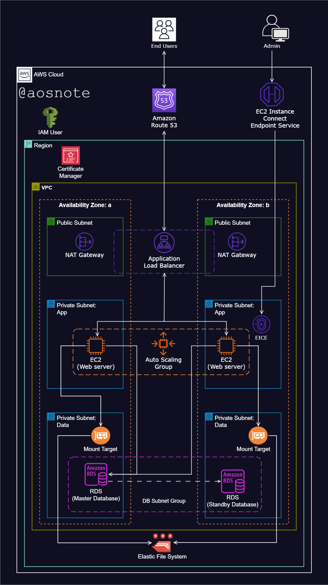

---
# Static Web App Hosting on AWS

## Overview

This project demonstrates how to host a WordPress website on AWS, leveraging various AWS services to ensure high availability, scalability, and security. The deployment involves setting up a Virtual Private Cloud (VPC), configuring an Application Load Balancer (ALB), utilizing Auto Scaling Groups, and implementing security best practices. The reference architecture diagram and deployment scripts are available in this repository.

## Table of Contents

- [Architecture](#architecture)
- [Prerequisites](#prerequisites)
- [Deployment Steps](#deployment-steps)
  - [Step 1: Set Up VPC](#step-1-set-up-vpc)
  - [Step 2: Configure Internet Gateway](#step-2-configure-internet-gateway)
  - [Step 3: Set Up Security Groups](#step-3-set-up-security-groups)
  - [Step 4: Launch EC2 Instances](#step-4-launch-ec2-instances)
  - [Step 5: Set Up Application Load Balancer](#step-5-set-up-application-load-balancer)
  - [Step 6: Configure Auto Scaling Group](#step-6-configure-auto-scaling-group)
  - [Step 7: Install WordPress](#step-7-install-wordpress)
  - [Step 8: Set Up DNS with Route 53](#step-8-set-up-dns-with-route-53)
- [Scripts](#scripts)
- [References](#references)

## Architecture

The architecture includes the following components:

1. **VPC with Public and Private Subnets**: Distributed across two availability zones for high availability.
2. **Internet Gateway**: Facilitates internet access for instances in the VPC.
3. **Security Groups**: Act as virtual firewalls to control inbound and outbound traffic.
4. **Application Load Balancer**: Distributes incoming traffic across multiple EC2 instances.
5. **Auto Scaling Group**: Automatically adjusts the number of EC2 instances based on demand.
6. **EC2 Instances**: Host the WordPress application.
7. **Elastic File System (EFS)**: Provides shared file storage for the WordPress application.
8. **Relational Database Service (RDS)**: Manages the WordPress database.
9. **Route 53**: Manages DNS for the domain.
10. **Certificate Manager**: Secures communications with SSL/TLS certificates.
11. **Simple Notification Service (SNS)**: Sends notifications for Auto Scaling events.

## Prerequisites

- AWS account with necessary permissions.
- Domain name registered in Route 53.
- GitHub account for version control.

## Deployment Steps

### Step 1: Set Up VPC

1. Create a VPC with CIDR block `10.0.0.0/16`.
2. Create two public subnets and two private subnets in different availability zones.
3. Enable DNS resolution and DNS hostnames for the VPC.

### Step 2: Configure Internet Gateway

1. Create an Internet Gateway and attach it to the VPC.
2. Update the route table for public subnets to route internet traffic through the Internet Gateway.

### Step 3: Set Up Security Groups

1. Create a security group for ALB to allow inbound HTTP (port 80) and HTTPS (port 443) traffic.
2. Create a security group for EC2 instances to allow inbound traffic from ALB and allow SSH access from your IP.
3. Create a security group for RDS to allow traffic from EC2 instances.

### Step 4: Launch EC2 Instances

1. Launch EC2 instances in private subnets.
2. Configure instances to use EC2 Instance Connect for secure access.
3. Install Apache, PHP, and MySQL as per the provided script.

### Step 5: Set Up Application Load Balancer

1. Create an ALB in public subnets.
2. Create a target group and register EC2 instances.
3. Configure listeners for HTTP and HTTPS traffic.

### Step 6: Configure Auto Scaling Group

1. Create a launch template with the provided script for setting up WordPress.
2. Create an Auto Scaling Group with the launch template.
3. Set scaling policies to manage the number of instances based on demand.

### Step 7: Install WordPress

1. SSH into one of the EC2 instances.
2. Mount the EFS file system to `/var/www/html`.
3. Download and configure WordPress as per the provided script.

### Step 8: Set Up DNS with Route 53

1. Create a hosted zone in Route 53.
2. Add an A record to point to the ALB DNS name.

## Scripts

### WordPress Installation Script

```bash
# create to root user 
sudo su 
# update the software packages on the ec2 instance  
sudo yum update -y 
# create an html directory  
sudo mkdir -p /var/www/html 
# environment variable 
EFS_DNS_NAME=fs-064e9505819af10a4.efs.us-east-1.amazonaws.com 
# mount the efs to the html directory  
sudo mount -t nfs4 -o nfsvers=4.1,rsize=1048576,wsize=1048576,hard,timeo=600,retrans=2,noresvport "$EFS_DNS_NAME":/ /var/www/html 
# install the apache web server, enable it to start on boot, and then start the server immediately 
sudo yum install -y httpd 
sudo systemctl enable httpd 
sudo systemctl start httpd 
# install php 8 along with several necessary extensions for wordpress to run 
sudo dnf install -y php php-cli php-cgi php-curl php-mbstring php-gd php-mysqlnd php-gettext php-json php-xml php-fpm php-intl php-zip php-bcmath php-ctype php-fileinfo php-openssl php-pdo php-tokenizer 
# install the mysql version 8 community repository 
sudo wget https://dev.mysql.com/get/mysql80-community-release-el9-1.noarch.rpm 
# install the mysql server 
sudo dnf install -y mysql80-community-release-el9-1.noarch.rpm 
sudo rpm --import https://repo.mysql.com/RPM-GPG-KEY-mysql-2023 
sudo dnf repolist enabled | grep "mysql.*-community.*" 
sudo dnf install -y mysql-community-server 
# start and enable the mysql server 
sudo systemctl start mysqld 
sudo systemctl enable mysqld 
# set permissions 
sudo usermod -a -G apache ec2-user 
sudo chown -R ec2-user:apache /var/www 
sudo chmod 2775 /var/www && find /var/www -type d -exec sudo chmod 2775 {} \; 
sudo find /var/www -type f -exec sudo chmod 0664 {} \; 
chown apache:apache -R /var/www/html 
# download wordpress files 
wget https://wordpress.org/latest.tar.gz 
tar -xzf latest.tar.gz 
sudo cp -r wordpress/* /var/www/html/ 
# create the wp-config.php file 
sudo cp /var/www/html/wp-config-sample.php /var/www/html/wp-config.php 
# edit the wp-config.php file 
sudo vi /var/www/html/wp-config.php 
# restart the webserver 
sudo service httpd restart
```

### Auto Scaling Group Launch Template Script

```bash
#!/bin/bash 
# update the software packages on the ec2 instance  
sudo yum update -y 
# install the apache web server, enable it to start on boot, and then start the server immediately 
sudo yum install -y httpd 
sudo systemctl enable httpd 
sudo systemctl start httpd 
# install php 8 along with several necessary extensions for wordpress to run 
sudo dnf install -y php php-cli php-cgi php-curl php-mbstring php-gd php-mysqlnd php-gettext php-json php-xml php-fpm php-intl php-zip php-bcmath php-ctype php-fileinfo php-openssl php-pdo php-tokenizer 
# install the mysql version 8 community repository 
sudo wget https://dev.mysql.com/get/mysql80-community-release-el9-1.noarch.rpm 
# install the mysql server 
sudo dnf install -y mysql80-community-release-el9-1.noarch.rpm 
sudo rpm --import https://repo.mysql.com/RPM-GPG-KEY-mysql-2023 
sudo dnf repolist enabled | grep "mysql.*-community.*" 
sudo dnf install -y mysql-community-server 
# start and enable the mysql server 
sudo systemctl start mysqld 
sudo systemctl enable mysqld 
# environment variable 
EFS_DNS_NAME=fs-02d3268559aa2a318.efs.us-east-1.amazonaws.com 
# mount the efs to the html directory  
echo "$EFS_DNS_NAME:/ /var/www/html nfs4 nfsvers=4.1,rsize=1048576,wsize=1048576,hard,timeo=600,retrans=2 0 0" >> /etc/fstab 
mount -a 
# set permissions 
chown apache:apache -R /var/www/html 
# restart the webserver 
sudo service httpd restart
```

## References

- [AWS VPC Documentation](https://docs.aws.amazon.com/vpc)
- [AWS EC2 Documentation](https://docs.aws.amazon.com/ec2)
- [AWS ELB Documentation](https://docs.aws.amazon.com/elasticloadbalancing)
- [AWS Auto Scaling Documentation](https://docs.aws.amazon.com/autoscaling)
- [AWS EFS Documentation](https://docs.aws.amazon
